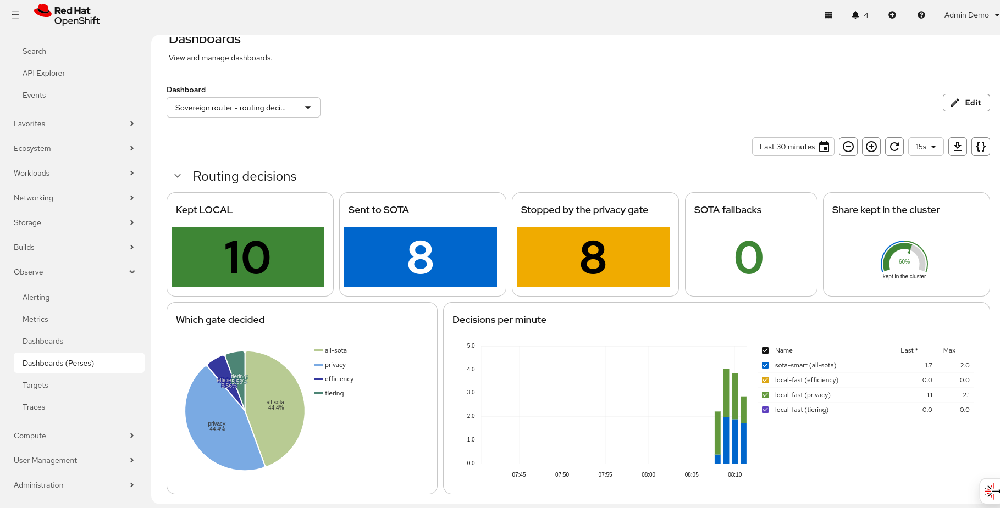

# Observability of the routing decisions

The router shows **why** each request goes to the local model or to the SOTA model: as a trace in the
OpenShift console (*Observe → Traces*) and as metrics (*Observe → Metrics*). Traces and metrics stay in
the cluster: the collector, Tempo and Prometheus run in the cluster, and nothing is sent outside.

> **Support status:** LiteLLM (which sends the traces and the metrics of the router) and Presidio are
> community software, not supported by Red Hat. The OpenTelemetry collector and Tempo come from the Red
> Hat build of OpenTelemetry and the Tempo Operator.

## What is where

| Item | Owner | Where |
|---|---|---|
| Operators (OpenTelemetry, Tempo, Cluster Observability), console plugin, user workload monitoring, Tempo tenant write permission | `ansible` repo | cluster-scoped |
| Tempo `tempo` (TempoMonolithic, tenant `router`), collector `otel` | component `observability` | namespace `observability` |
| Spans and router metrics | `router` repo (hook code, v0.5.0+) | LiteLLM pods |
| `otel` and `prometheus` callbacks, `OTEL_*` env, metrics port 9091, ServiceMonitor | component `litellm-router` | namespace `maas-routing` |
| vLLM metrics (ServiceMonitor `<model>-metrics`) | created by RHOAI | namespace `local-models` |
| Decision model: vLLM metrics on port 8000, NetworkPolicy `dgemma-decision-metrics` from monitoring | component `decision-model` | namespace `local-models` |

## The dashboard

*Observe → Dashboards*, project `maas-routing`, dashboard **Sovereign router - routing decisions**
(Perses, started by the Cluster Observability Operator; component `litellm-router`). It refreshes every
15 seconds and shows:

- **Routing decisions**: requests kept LOCAL, sent to SOTA, stopped by the privacy gate, SOTA fallbacks,
  the share kept in the cluster (gauge), which gate decided (pie chart), decisions per minute.
- **Latest traces**: two trace tables side by side, kept LOCAL and sent to SOTA (click a trace to see the
  gates), and links to *Observe → Traces* with the same filters.
- **Models**: tokens per minute, answer time p90 and privacy score, by model.



*The section Routing decisions after one run of the `validation` repo (default groups) on a new
cluster, 2026-09-28: 18 requests, 10 kept LOCAL and 8 sent to SOTA. The query of the gauge returns 55.6%; the console
shows it as 60%.*

The counters count since the start of the LiteLLM pods (2 replicas, summed). The dashboard reads Thanos
and Tempo through Perses with the token of the console user. The application menu of the console (grid
icon) also has the section *Sovereign Self-Healing demo* with the same trace links (ansible repo).

## The dashboard for the audience

*Observe → Dashboards*, project `maas-routing`, dashboard **Sovereign AI - at a glance**
(`sovereign-at-a-glance`, component `litellm-router`, only with `observability.enabled`). A few big
numbers for the time range at the top (default 30 minutes), for the audience of the demo:

- requests kept in the cluster (share), tokens processed in the cluster, tokens sent to the external
  model, sensitive requests kept local (privacy gate), requests over the token budget (429);
- live: requests and tokens per minute, in the cluster and to the external model; with the `gpu`
  profile also how busy the local GPU is.

The numbers use `increase()` over the time range: a series that starts inside the range (a new pod)
misses its first requests, so they are close, not exact. The details are in the two other dashboards.

## The operations dashboard

*Observe → Dashboards*, project `maas-routing`, dashboard **Sovereign stack - operations** (component
`litellm-router`, only with `observability.enabled`). It is for the team; the demo view is the dashboard
above. Two variables choose the router pods and the model pods. It refreshes every 30 seconds and shows:

- **Router pods**: requests per minute by pod and target, tokens per minute by pod and served model,
  answer time p90 and SOTA -> local fallbacks, by pod.
- **Local model and GPU**: requests running and waiting in vLLM, tokens per second (generated and prompt),
  KV cache used; with the `gpu` profile also GPU utilization, memory and power (NVIDIA DCGM exporter).
  The model pods variable lists only the pods of the local model (label `model_name`).
- **Decision model and GPU** (only with `decisionModel.enabled`): vLLM requests per second behind the
  decision server, latency per vLLM request (p50 and p95), GPU utilization and memory of its pod. The
  vLLM series carry `model_name="dgemma"`; the decision server itself has no metrics.
- **Gateway**: one gauge per tier of `tiers` (tokens in the last window against the limit; approximate,
  because Limitador counts in a fixed window that starts with the first call), tokens counted and 429
  answers per minute by tier, API key checks of Authorino per minute.
- Links to the other dashboards.

The Kuadrant metrics need the ansible repo: the monitors of Limitador and Authorino and the
TelemetryPolicy that adds the label `tier`. A new tier in `tiers` gets its gauge without changes here.

## The trace of one request

```
litellm-router: <proxy request span>             (LiteLLM, one per HTTP request)
├── router.chain                                  route.target = local-fast | sota-smart
│   │                                             route.decided_by = efficiency | privacy | tiering | all-sota
│   │                                             route.requested, route.team, route.reason
│   ├── gate.efficiency                           gate.verdict = local | sota, gate.reason
│   └── gate.privacy                              gate.verdict, gate.reason,
│       │                                         privacy.score, privacy.threshold,
│       │                                         privacy.team_key, privacy.signals
│       └── presidio.analyze (one per language)   presidio.language, presidio.entities_found
└── litellm_request                               the model call; hidden_params shows the api_base:
                                                  http://<model>-predictor.local-models.svc... (LOCAL)
                                                  or the external provider (SOTA)
```

- The first gate that says LOCAL ends the chain: a short question has only `gate.efficiency`.
- `privacy.signals` shows what the privacy engine found, for example `credit_card:0.85` or
  `PERSON@0.85(<2 words):0.00` (found but not counted).
- With the decision model, Presidio NER is off (`NER_ENABLED=0`, router v0.10.0): no
  `presidio.analyze` span, and `privacy.signals` has no NER entities.
- An error (for example Presidio down) marks its span as failed; the request stays LOCAL
  (fail-closed), and the trace shows why.
- The LLM call is a sibling of `router.chain`, not a child: LiteLLM creates it under the proxy span.
- **Prompt and answer text are in the `litellm_request` span** (LiteLLM default). They stay in the
  cluster, and only users with the read permission on the Tempo tenant `router` can see them
  (cluster-admin has it). To remove them, set `OTEL_INSTRUMENTATION_GENAI_CAPTURE_MESSAGE_CONTENT=false`
  on the LiteLLM Deployment.

Each `[policy-router] {...}` log line has the `trace_id` of its trace:

```bash
oc logs -n maas-routing deploy/litellm --since=5m | grep policy-router
```

## Metrics

User workload monitoring scrapes the LiteLLM pods on port 9091 (ServiceMonitor `litellm`). The port is
open only to the monitoring namespaces, and the public route refuses `/metrics` (AuthPolicy, 403).

| Metric | Labels | Meaning |
|---|---|---|
| `router_requests_total` | `routed_to`, `decided_by`, `team` | One per routing decision |
| `router_privacy_score` (histogram) | `team` (threshold key) | Privacy score of the requests that reached the privacy gate |
| `router_sota_budget_used_tokens` (gauge) | `pod` | SOTA tokens counted by the efficiency gate budget. Always 0 while the cap is off (`sota_token_budget: 0`, the default). **Per pod** when it is on |
| `litellm_total_tokens_metric_total` | `requested_model`, `model`, ... | Tokens per model alias (`local-fast`, `sota-smart`) and served model (`model`), from LiteLLM |
| `litellm_deployment_successful_fallbacks_total` | `requested_model`, `fallback_model` | A SOTA call failed and LiteLLM used `local-fast` |
| `litellm_request_total_latency_metric` (histogram) | `requested_model`, ... | End-to-end latency per model, from LiteLLM |

Useful queries (*Observe → Metrics*, project `maas-routing`):

```promql
# Decisions per minute, by target and by gate
sum by (routed_to, decided_by) (rate(router_requests_total[5m])) * 60
# Share of requests kept local
sum(rate(router_requests_total{routed_to="local-fast"}[5m])) / sum(rate(router_requests_total[5m]))
# Median privacy score
histogram_quantile(0.5, sum by (le) (rate(router_privacy_score_bucket[5m])))
# Tokens per model alias and served model in the last 10 minutes
sum by (requested_model, model) (increase(litellm_total_tokens_metric_total[10m]))
# SOTA -> local fallbacks in the last hour
sum(increase(litellm_deployment_successful_fallbacks_total{requested_model="sota-smart"}[1h]))
# SOTA budget used, per pod
max by (pod) (router_sota_budget_used_tokens)
```

## Try it

Send one prompt with synthetic personal data and one without. Both are long and complex, so the
efficiency gate says SOTA; only the privacy gate decides.

```bash
HOST=https://router.$(oc get ingresses.config/cluster -o jsonpath='{.spec.domain}')
KEY=$(oc get secret apikey-research-1 -n maas-routing -o jsonpath='{.data.api_key}' | base64 -d)

# With synthetic PII (a test card number): stays LOCAL, decided_by=privacy
curl -sk "$HOST/v1/chat/completions" -H "Authorization: Bearer $KEY" -H 'Content-Type: application/json' \
  -d '{"model":"auto","messages":[{"role":"user","content":"Analyze the trade-offs between event sourcing and a classic CRUD model for an order management system. The customer Mario Rossi paid with card 4111 1111 1111 1111."}]}' \
  | python3 -c 'import json,sys; print(json.load(sys.stdin)["model"])'

# Without personal data: goes to SOTA (in local-only mode sota-smart is the local model)
curl -sk "$HOST/v1/chat/completions" -H "Authorization: Bearer $KEY" -H 'Content-Type: application/json' \
  -d '{"model":"auto","messages":[{"role":"user","content":"Analyze the trade-offs between event sourcing and a classic CRUD model for an order management system, with a short example."}]}' \
  | python3 -c 'import json,sys; print(json.load(sys.stdin)["model"])'

# The two trace ids
oc logs -n maas-routing -l app=litellm --since=2m | grep policy-router | grep -o "'trace_id': '[0-9a-f]*'"
```

Then, in the console:

1. *Observe → Traces*. Select the Tempo instance `observability / tempo` and the tenant `router`.
2. Filter on the service `litellm-router`, or paste a trace id from the log.
3. Open the trace. In `gate.privacy` of the first request, `privacy.signals` shows `credit_card` and
   the score above the threshold, and `litellm_request` calls the `qwen38-local-predictor` service in
   `local-models`. In the second request both gates say `sota` and `litellm_request` calls the external
   provider.

The public route refuses the metrics path:

```bash
curl -sk -o /dev/null -w '%{http_code}\n' "$HOST/metrics" -H "Authorization: Bearer $KEY"   # 403
```
